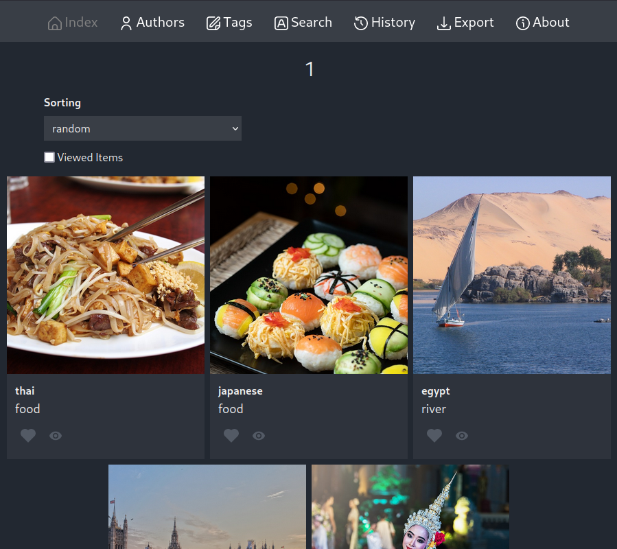

# Chrys

Image-set viewer for viewing manga, comics, and more

## Installation

First install npm packages

    npm install

Optionally, make edit to the consts file in `/src/lib/consts.ts`

Next, create a `.env` file, and optionally make edits to the variables

    cp env.example .env

Then build the project

    npm run build

Before running the application, make sure to start the
image server from the `PUBLIC_IMAGE_SERVER` variable

Finally, run the application

    node ./build/index.js

## Development

In a development environment

    npm run dev

## Docker

First build the project

    npm run build

Then run

    npm run docker-build

## Sync

There's an npm script to sync the project with a server

First create a `sync_server` file and change permissions to be executable

Then add commands to sync with a server for example, shell scripts

Finally, run

    npm run sync_server